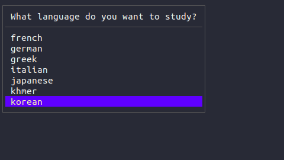
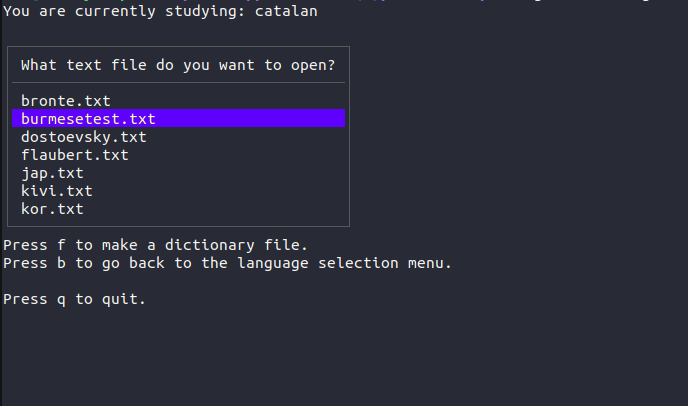

<div align="center">
  
  <h1>LinGo</h1>
</div>

LinGo is a terminal based language acquisiton application, which allows you to learn languages while reading texts. The application allows you to load texts, read them, mark words with different colors based on your knowledge of them, listen the pronunciation of words on the spot, latinize each word (if the script is not a latin script) and get a translation of each word without leaving the application; all the words you marked will then be saved locally on your machine and can be easily imported into anki or memrise flashcards. The application is entirely keyboard-based, making it way faster to use compared to the other alternatives. 

The app also allows you to visualize the stroke order for japanese kanji and chinese hanzi; you can do so by pressing the key "7" while hovering over a character (if the cursor is hovering over a collection of characters it will just allow you to visualize the stroke order for all the characters).

To look at the full documentation, check the [LinGo website](https://lingotext.github.io/).

If the documentation was not clear enough, check out [these youtube tutorials](https://www.youtube.com/watch?v=BvBf88N-s6c&list=PL5_YAjcfw5ollApUQ3QYHDFSXzKiiKWPU).

The application is coded in Go (also known as golang) alongside the ELM-architecture based framework [Bubbletea](https://github.com/charmbracelet/bubbletea).

Below some tests to show how the application works.

https://github.com/hsnborn22/LinGo/assets/146590127/bd237dd4-11a7-4c0a-b9fe-fadccd8d4547


https://github.com/hsnborn22/LinGo/assets/146590127/322a5daa-e7e0-477c-9f11-1131706b9b3d

Here is a test of the application for thai:

https://github.com/hsnborn22/LinGo/assets/146590127/60d7f117-a51a-4bb6-b1fe-6d5b12183ecf

## Motivation:
The motivation for the application comes from multiple sources; on a conceptual level, the application is based on the technique of language aquisition via text, a technique which is deemed to be highly effective by many linguists and polyglots. However, when you read a text in a language you're still learning, new words that you don't know and you don't know the pronunciation of are quite common: these occurences force you to move your attention away from the text, go to an online (or physical) dictionary, look up the meaning of the word, listen to its pronunciation exc. With this application (which really started out as a tool for myself precisely to speed up this process) you can do all of this without moving away from the text you're reading, making the process of learning by aquisition faster, easier and more enjoyable.

Another necessity which we could encounter frequently is that of remembering these new words we encountered and then maybe inserting them in some flashcard system in order to master them.  
Let's envision this process if we had to absorb a language by reading physical books via an "algorithmic" procedure:

Reading --> encounter new word --> look up meaning and pronunciation elsewhere --> sign on the physical book that we do not know this word (for example by underlining it --> when we are done with our reading session, find all those words and manually make them into an anki or memrise flashcard set.

Wow, it takes really a lot of time! Well, I have good news for you: this application automates all of this for you. While you're reading, you can mark a word as known by pressing the key "3" (and the app will mark it as green), as semi-known by pressing the key "2" (and the app will mark the word as yellow) and as not known by pressing the key "1" (and the app will mark the word as red). By pressing the key 0 you can decide to ignore a word (by default, if you never encountered a word before, the value is set to 0 so you can decide if you know it or not).

All this information about words and how well you know them are then saved locally on your computer on a json file, so that when you open another text in the same language, and that text has a word that you already encountered in another text, it will still have the same value that you assigned to it. 

To make flashcards out of the words that you do not know, you can then just press the "f" key in the language menu or directly while you're reading a text, and a new file "dictionary.txt" will be created in the folder of the language you're studying. This file is formatted in such a way that can be imported into flashcards in both anki and memrise, since the words will be stored like this:

word1,translation1

word2,translation2

...

Summing everything up, the goal of the app is to provide a lightweight, fast to use, user-friendly terminal-based solution to language aquisition by texts, that gives off "VIM" vibes. I'm sure if you're a software developer who likes both VIM and learning languages you will really like this. 

## Languages supported:

The app now supports tts and instant translation while studying a text [for over 150 languages](https://lingotext.github.io/language-support.html), as well as text tokenization; it supports text tokenization also for languages which are not separated by spaces, such as thai, japanese, chinese, lao, burmese and khmer via nlps. The tokenization for these languages, however, is implemented in python, so in order to make it work you will have to run a python script (which can be server_thai.py, server_japanese.py,server_burmese.py, server_lao.py, server_chinese.py or server_khmer.py) before loading your text.


The app also supports conlangs (like toki pona, lojban or even possibly your own) but the tts and instant translation tools might not work, so you'll just have to use it for tokenization and word memorization.  


The app also supports latinization for the following non latin scripts (this means that you can get a phonetical approximation of each word expressed in latin script while reading the text by pressing the key "7"):

* Japanese kana and kanji
* Chinese hanzi
* Korean hangul
* Ge'ez script (used by tigre, tigrinya, amharic exc.)
* Hindi
* Arabic
* Hebrew
* Greek
* Persian
* Burmese
* Lao
* Khmer
* Thai
* Armenian
* Georgian
* Cyrillic (russian, serbian, mongolian, kazakh, bulgarian, ukrainian and many more)

I plan on adding latinization support for other non latin scripts too, such as old mongolian script and tibetan.


## Installation:
In this section we will see how to install the program and how to run it on your computer. You can install LinGo in 2 ways:

1) Installing the binaries (executables)

2) Building from source

I already state that building from source will be considerably harder, so I recommend doing so if and only if you plan on modifying and contributing to the software. 

### Downloading the binaries

Just go to the [tags tab](https://github.com/hsnborn22/LinGo/tags), and then select the latest version. From here, download the archive file for your operating system (there are binaries for windows, linux and macOS).
Once you have downloaded the zip, unzip it whenever you want, enter in the folder and execute the executable file: you are ready to go! The app should be already working. 


**Note**: If you're using pipewire instead of alsa on your system, the app might not work; if that is the case, i.e if the errors you're encountering are related to alsa and audio mixing problems, then just run the following command:

```bash
sudo apt install libasound2-dev
```

### Building from source
To build LinGo from source, you will first need a go compiler on your machine. The go version that was used to code LinGo is the (currently) latest version go 1.21.4 . It is preferred that you use go 1.21.4, even though it probably works even with older versions (haven't checked yet). With this said, if you don't have go installed on your machine, you can follow the installation guide on [their official website](https://go.dev/doc/install) (they have a guide for linux,macOS and windows). Once you have installed go on your machine, download the source code from the repository by clicking on the green "code" button on the top, and then "download zip" 


(alternatively you can decide to clone the repo from the terminal with the following command).

```bash
git clone https://github.com/hsnborn22/LinGo.git
```

Once you have the repo installed on your machine, head over to the "src" folder (this is the folder that contains the source code) and run the following command:

```bash
go get
```
This will install all the dependencies necessary for the application to work. Once you have done this, you are ready to (Lin)go. To start the application run the following command (while staying in the src folder).

```bash
go run main.go
```

## Getting thai,japanese,chinese,khmer,lao and burmese to work:

It doesn't matter if you installed the app using the binaries or built it from source, if you want to make the "scriptio continua" languages work, you will have to run the respective server for the language in the scriptioContinuaTokenization folder:
To do so you will have to have python installed on your computer; for a quick installation guide [go here](https://realpython.com/installing-python/).


This is because the tokenization for most of these languages is implemented via nlp models with deep neural networks, and python has a wider support for ML/AI/nlp libraries; for this reason I decided to inter-op the python tokenization code with the Go main application via a tcp/ip socket.


Once you have python installed and set up on your computer, go in the scriptioContinuaTokenization folder and type:

```bash
pip install -r requirements.txt
```

Then run the server for your language: for example, supposing that you want to study japanese, you would have to run:

```bash
python3 server_japanese.py
```

**Note**: The path variable for python might be different, so don't panic if this line of code above doesn't work. For you it might be "python server_japanese.py".


If you can't get the python server to run on windows because you're encountering errors with the pip install -r requirements.txt command, try to input in sequence the following lines of code (in this way you will install all the required libraries separately):

```bash
pip install -U pip setuptools wheel
pip install -U spacy
python -m spacy download zh_core_web_sm
python -m spacy download ja_core_news_sm
pip install pythainlp
pip install laonlp
```

## Using the app:
When booting the app, you will be greeted by a menu that lists all the pre-created languages you can study (all these languages have tts and instant translation support). You can navigate these menu with the arrow keys &darr; and &uarr; .
Alternatively, you can navigate it using the j and k keys (VIM style). To select the language of your choice, move the cursor to the language, and press the key &crarr; (enter).



Once you have selected the language you want to study, you can now select what text to study: in order to import a text, just head over to the /texts folder, and add a .txt file containing your text in the intended target language. Try to give it a meaningful name so that you will remember what the text is about after. The way in which you navigate the text selection menu is exactly the same as the previous one, i.e with the down/up arrows or j/k keys, and then select with enter. Here, however, you can also press the 'b' key to go back to the language selection menu, in case you picked a wrong language. You can also quit directly by pressing the 'q' key.



Once you have selected a text, you will now be confronted with it. The way in which the app works is simple; you can skim through the text, moving from one word to another, using a cursor; to move the cursor, you can use the up/down/left/right arrow keys to move up/down/left/right in the text respectively, or you can also use the h/j/k/l keys (VIM style) (h to move left, j to move down, k to move up, l to move right). If the text you imported is long, it might be comprised of several pages; to move from one page to another you can use the a/d keys (a key to move one page to the left and the d key to move one page to the right). When your text has maaaaany pages, it might be tiring to set your cursor to the current page manually, so I added a key-bind to set your cursor to the start of the current page; you can do so by pressing 'm'.

Ok but now you might ask: what is the cursor used for? While hovering a word with your cursor you can use the following key bindings to do the following things:

* 1 --> list the word as not known (the word will become red)
* 2 --> list the word as not very well known (the word will become yellow)
* 3 --> list the word as known (the word will become green)
* 0 --> list the word as ignored (all new words are by default set as ignored, since it's up to you to decide how well you know it and if you know it or not. The color of the word will be white)
* 4 --> Listen to the pronunciation of the word with text-to-speech
* 5 --> Give an instant translation of the word in your language (if you're reading this documentation in english then you probably wish to use the app in english too).
* 6 --> Latinize the current word; the app currently supports latinization for: chinese, japanese, korean, arabic, greek, hindi, persian, ge'ez, armenian, georgian, lao, burmese, thai, khmer and all languages that use cyrillic.
* 7 --> Get stroke order of the character (only works for chinese and japanese)


This data about words is then stored locally in json files inside the languages folder (specifically, the file is languages/"language name"/words.json).

### Adding custom languages
If the language you're studying is not currently on the list, you can add it very fast by doing the following 3 steps (this is only temporary, as I will add an easier way to add new languages directly in the application soon):

1) Go in the languages folder, and create a folder with the name of your language (e.g create a folder named tokipona if you're studying tokipona).
2) Once you have done this, head over to the languageHandler.go file in the "languageHandler" folder, and add the following 2 lines of code inside of both the LanguageMap2 and the LanguageMap variables:

```go
"your-language-name":"your-language-id"
```
The value on the right can really be whatever you want, since the ID is for the API calls for translation and text-to-speech, and your custom language probably isn't supported in these APIs.
Now the new language you added should pop out in the menu, and you should be able to study it. Notice that the tts and translation could not work, since this depends on the APIs used for the 2 services.

### Changing the language of the interface and the translations:

Maybe you're not super familiar with english and you want to study your target language in another language; maybe you could even want to use this app to study
english. There are 6 supported languages for your interface and translation so far: english, spanish, french, russian, italian and german. To change your interface to one of these languages, just go to the bootLanguage.txt file in the "setup" folder, and change the value inside to 

1) en for english
2) it for italian
3) es for spanish
4) fr for french
5) ru for russian
6) de for german

Once you have done this, your app should now be in your desired language.


The tokenization of thai was done with the [pythainlp library](https://github.com/PyThaiNLP/pythainlp), the tokenization of burmese was done with [myan-word-breaker](https://github.com/stevenay/myan-word-breaker/tree/master), and finally the tokenization of lao was achieved with [laonlp](https://github.com/wannaphong/LaoNLP).

The tokenization of chinese and japanese was done using the spacy nlp library for python.

## Contributing

If there is anything that you would like to fix or add, I would be really grateful.

[Check out the contribution guidelines](CONTRIBUTING.md)


## License

[MIT](LICENSE)

## Code of conduct 

[Code of conduct](CODE_OF_CONDUCT.md)
