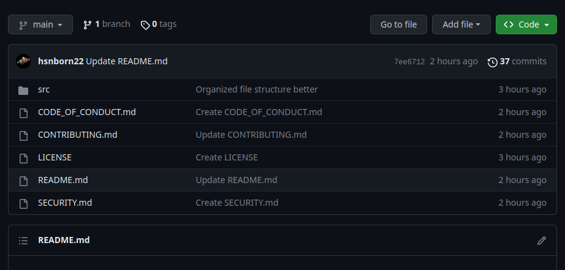
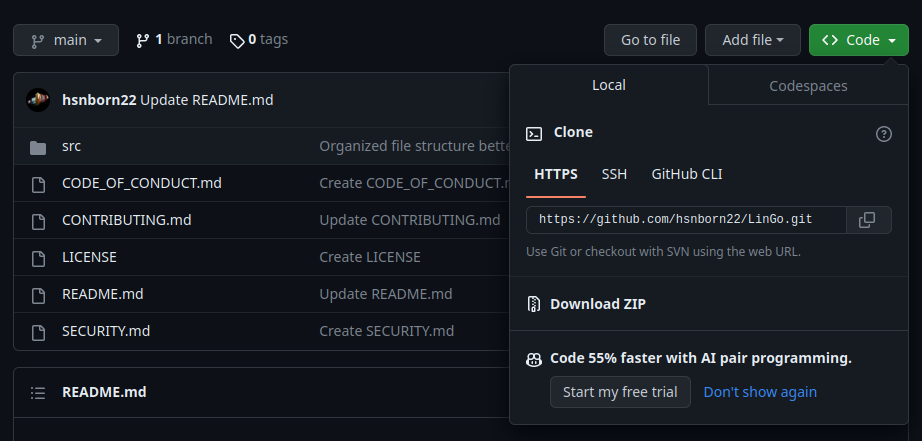

# LinGo
LinGo is a terminal based language aquisiton application, which allows you to learn languages while reading texts. The application allows you to load texts, read them, mark words with different colors based on your knowledge of them, listen the pronunciation of words on the spot and get a translation of each word without leaving the application; all the words you marked will then be saved locally on your machine and can be easily imported into anki or memrise flashcards. The application is entirely keyboard-based, making it way faster to use compared to the other alternatives. 

The application is coded in Go (also known as golang) alongside the ELM-architecture based framework [Bubbletea](https://github.com/charmbracelet/bubbletea).

Below some tests to show how the application works.

https://github.com/hsnborn22/LinGo/assets/146590127/bd237dd4-11a7-4c0a-b9fe-fadccd8d4547


https://github.com/hsnborn22/LinGo/assets/146590127/c55b0472-71cd-4615-bed0-7f5786bf9309

## Motivation:
The motivation for the application comes from multiple sources; on a conceptual level, the application is based on the technique of language aquisition via text, a technique which is deemed to be highly effective by many linguists and polyglots. However, when you read a text in a language you're still learning, new words that you don't know and you don't know the pronunciation of are quite common: these occurences force you to move your attention away from the text, go to an online (or physical) dictionary, look up the meaning of the word, listen to its pronunciation exc. With this application (which really started out as a tool for myself precisely to speed up this process) you can do all of this without moving away from the text you're reading, making the process of learning by aquisition faster, easier and more enjoyable.

Another necessity which we could encounter frequently is that of remembering these new words we encountered and then maybe inserting them in some flashcard system in order to master them.  
Let's envision this process if we had to absorb a language by reading physical books via an "algorithmic" procedure:

Reading --> encounter new word --> look up meaning and pronunciation elsewhere --> sign on the physical book that we do not know this word (for example by underlining it --> when we are done with our reading session, find all those words and manually make them into an anki or memrise flashcard set.

Wow, it takes really a lot of time! Well, I have good news for you: this application automates all of this for you. While you're reading, you can mark a word as known by pressing the key "3" (and the app will mark it as green), as semi-known by pressing the key "2" (and the app will mark the word as yellow) and as not known by pressing the key "1" (and the app will mark the word as red). By pressing the key 0 you can decide to ignore a word (by default, if you never encountered a word before, the value is set to 0 so you can decide if you know it or not).

All this information about words and how well you know them are then saved locally on your computer on a json file, so that when you open another text in the same language, and that text has a word that you already encountered in another text, it will still have the same value that you assigned to it. 

To make flashcards out of the words that you do not know, you can then just press the "f" key in the language menu or directly while you're reading a text, and a new file "dictionary.txt" will be created in the folder of the language you're studying. This file is formatted in such a way that can be imported into flashcards in both anki and memrise, since the words will be stored like this:

word1,translation1

word2,translation2

...

Summing everything up, the goal of the app is to provide a lightweight, fast to use, user-friendly terminal-based solution to language aquisition by texts, that gives off "VIM" vibes. I'm sure if you're a software developer who likes both VIM and learning languages you will really like this. 

## Languages supported:

At the current stage the application supports virtually all languages that are "tokenized with spaces", i.e where words are separated by spaces (almost all european languages are like this, as well as many asian languages such as indonesian, tagalog,mongolian, kazakh exc.). The app also supports mandarin chinese (both simplified and traditional) both for tts and for in-text translations. Languages such as arabic, korean and japanese are currently not supported yet.
If you want to study a less popular language which is still supported (maybe a conlang) such as lojban, toki pona or even your own conlang, a procedure to add it to the app will be explained after (don't worry it's very easy). However note that tts or translation might not be available. 

## Installation:
In this section we will see how to install the program and how to run it on your computer. I'll soon add downloadable binaries for most operating systems when I will expand the project a bit, so building from source will not be necessary anymore, but for now this is the only way to run the program.

### Building from source
To build LinGo from source, you will first need a go compiler on your machine. The go version that was used to code LinGo is the (currently) latest version go 1.21.4 . It is preferred that you use go 1.21.4, even though it probably works even with older versions (haven't checked yet). With this said, if you don't have go installed on your machine, you can follow the installation guide on [their official website](https://go.dev/doc/install) (they have a guide for linux,macOS and windows). Once you have installed go on your machine, download the source code from the repository by clicking on the green "code" button on the top, and then "download zip" 






(alternatively you can decide to clone the repo from the terminal with the following command).

```bash
git clone https://github.com/hsnborn22/LinGo.git
```

Once you have the repo installed on your machine, head over to the "src" folder (this is the folder that contains the source code) and run the following command:

```bash
go get
```
This will install all the dependencies necessary for the application to work. Once you have done this, you are ready to (Lin)go. To start the application run the following command (while staying in the src folder).

```bash
go run main.go
```

## Using the app:
When booting the app, you will be greeted by a menu that lists all the pre-created languages you can study (all these languages have tts and instant translation support). You can navigate these menu with the arrow keys &darr; and &uarr; .
Alternatively, you can navigate it using the j and k keys (VIM style). To select the language of your choice, move the cursor to the language, and press the key &crarr; (enter).


Once you have selected the language you want to study, you can now select what text to study: in order to import a text, just head over to the /texts folder, and add a .txt file containing your text in the intended target language. Try to give it a meaningful name so that you will remember what the text is about after. The way in which you navigate the text selection menu is exactly the same as the previous one, i.e with the down/up arrows or j/k keys, and then select with enter. Here, however, you can also press the 'b' key to go back to the language selection menu, in case you picked a wrong language. You can also quit directly by pressing the 'q' key.

Once you have selected a text, you will now be confronted with it. The way in which the app works is simple; you can skim through the text, moving from one word to another, using a cursor; to move the cursor, you can use the up/down/left/right arrow keys to move up/down/left/right in the text respectively, or you can also use the h/j/k/l keys (VIM style) (h to move left, j to move down, k to move up, l to move right). If the text you imported is long, it might be comprised of several pages; to move from one page to another you can use the a/d keys (a key to move one page to the left and the d key to move one page to the right). When your text has maaaaany pages, it might be tiring to set your cursor to the current page manually, so I added a key-bind to set your cursor to the start of the current page; you can do so by pressing 'm'.

### Adding custom languages
If the language you're studying is not currently on the list, you can add it very fast by doing the following 3 steps (this is only temporary, as I will add an easier way to add new languages directly in the application soon):

1) Go in the languages folder, and create a folder with the name of your language (e.g create a folder named tokipona if you're studying tokipona).
2) Once you have done this, head over to the languageHandler.go file in the "languageHandler" folder, and add the following 2 lines of code inside of both the LanguageMap2 and the LanguageMap variables:


```go
"your-language-name":"your-language-id"
```
The value on the right can really be whatever you want, since the ID is for the API calls for translation and text-to-speech, and your custom language probably isn't supported in these APIs.
Now the new language you added should pop out in the menu, and you should be able to study it. Notice that the tts and translation could not work, since this depends on the APIs used for the 2 services.


## License

[MIT](LICENSE)

## Code of conduct 

[Code of conduct](CODE_OF_CONDUCT.md)
